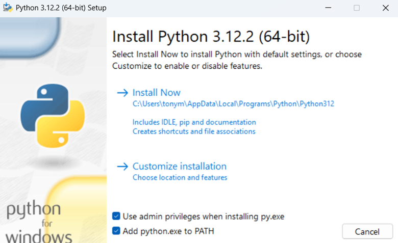

Generación automática de programas de cursos
============

### What is this repository for?

* Este repositorio fue creado para la generación automática de los programas de cursos de la Escuela de Ingeniería Electromecánica del Tecnológico de Costa Rica.

### How do I set up?

Si el programa Python está instalado en su computadora, diríjase al Paso 6. De lo contrario inicie en el Paso 1. 

* Paso 1: Descargar Python. El siguiente es el enlace de descarga con la última versión https://www.python.org/ftp/python/3.12.2/python-3.12.2-amd64.exe
* Paso 2: Ejecute el instalador.
* Paso 3: Marque las casillas “Use Admin privileges when installing py.exe” y “Add Python.exe to PATH”. Seguidamente dar click en “Install Now”

* Paso 4: Una vez finalizada la instalación, en la barra de búsqueda de Windows escriba “cmd” y abra el Símbolo del sistema (“Command Prompt”). Otra opción es usar el comando “windows+R” y de igual forma escribir “cmd” seguido de la tecla “Enter”. 
* Paso 5: Se deben instalar las siguientes librerías: pandas y pylatex. Para ello escriba el código “pip install pandas” seguido de la tecla “Enter”. Una vez instalada la librería pandas, escriba el siguiente código “pip install pylatex” seguido de la tecla “Enter”.
* Paso 6: Para corroborar las librerías instaladas, en el Símbolo del sistema (“Command Prompt”) escriba el siguiente código “pip list” seguido de la tecla “Enter”. Verifique que se encuentren instaladas las siguientes librerías: pandas, numpy y Pylatex. De faltar alguna de ellas, instálela como se hizo en el Paso 5.
* Paso 7: Descargar e instalar Miktex. El siguiente es el enlace de descarga con la última versión https://miktex.org/download/ctan/systems/win32/miktex/setup/windows-x64/basic-miktex-24.1-x64.exe
* Paso 8: Descargar e instalar Perl. El siguiente es el enlace de descarga con la última versión https://github.com/StrawberryPerl/Perl-Dist-Strawberry/releases/download/SP_53822_64bit/strawberry-perl-5.38.2.2-64bit.msi
* Paso 9: Descargar e instalar GitHub Desktop. El siguiente es el enlace de descarga con la última versión https://central.github.com/deployments/desktop/desktop/latest/win32
* Paso 10: Si no tiene cuenta en GitHub, regístrese, de lo contrario, inicie sesión. Una vez dentro de la aplicación dar click en “Clone a repository from the Internet…”
* Paso 11: Elija el repositorio “IEM_programas” y dar click en “Clone”

Una vez clonada la carpeta, ya puede generar cambios en los documentos. Cuando un cambio se realice, debe dar cliack al botón “Commit to main”  y seguidamente dar click al botón “Push origin”

### Who do I talk to? ###

* [Juan J. Rojas](mailto:juan.rojas@itcr.ac.cr)